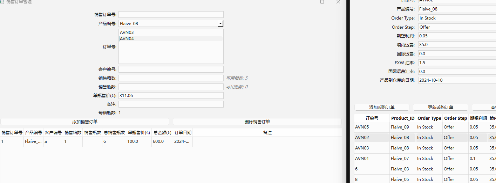
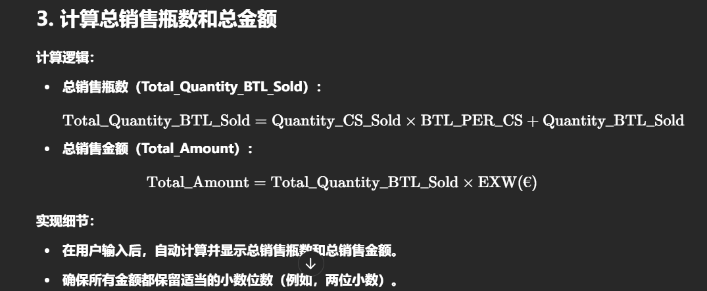

2024-10-31
需求增加：
主要涉及以下几点：
在销售订单管理中，增加一个“订单号”输入项，用于选择库存中的订单号，并支持多选。
当输入产品编号后，系统自动从库存中找到对应的所有订单号（库存数量不为零的），并按照到仓库日期从远到近排序，供用户选择。
在扣减库存时，根据用户选择的订单号和输入的销售数量，按照到仓库日期从远到近的顺序进行扣减，支持从多个订单中扣减库存。
在销售数量旁，显示当前可用的库存箱数和瓶数，供用户参考。
在销售订单管理中，将单瓶售价改为手动输入，不再与产品编号关联。

详细需求：
Finished:
    29. 在销售订单管理中，产品编号下方增加输入项。名称为：订单号。
    29.1 订单号的数据来源于库存管理中的订单号。
    29.2 当用户输入了产品编号后，系统自动通过产品编号找到库存中的对应的所有订单号.
    29.3 并且将总瓶数不为零的订单通过下拉框的方式在订单号的输入栏显示出来。
    29.4 显示时的排列顺序，按照库存管理中的到仓库日期，从远到近的时间排列。
    29.5 订单号可以通过键盘按住ctrl键加鼠标左键点击的方式进行多选
    30.1 
    bug:销售订单管理中，假设原始库存为5整箱没有散瓶。当销售订单是散瓶时，删除此销售订单，库存并未恢复原来的箱数而是4箱6瓶。但，假设原始库存为4箱3瓶的库存，销售订单为8瓶，删除此销售订单，库存会恢复到4箱3瓶。
    ==>fixed
    31. 用户在选择订单号后，销售箱数和销售瓶数旁用浅黑色花体字显示当前可用的箱数和瓶数。数据来自于库存订单中的库存-瓶数和库存-箱数。
        bug:
                    Pending:1.每箱瓶数的显示不会随着用户选择不同的订单号发生改变。难点：当用户同时选择多个订单时，不好显示，布局不好看。考虑删掉每箱瓶数？或者放到每个订单号的右侧？
            Fixed:2. 单瓶售价没有根据订单号的选择而更改！！！！重要！！！！！需要改成能够实时更新的。
                    ==>单凭售价已经改为手动输入。可以考虑将不同订单的售价显示在旁边作为用户参考。现在代码会在输入编号后显示在输入栏。
        3. 销售扣除时，没有选的订单不能被扣。选了的订单，才按照扣除规则进行扣除。
        4. 当销售订单被删除（改名为撤销）时，对应的订单恢复对应的数目。现在是都恢复给同一个订单去了。
        Fixed   5.AVN04被删除了，但是采购订单的表里也没了，库存表里还有！！！
                5.1 但是销售订单能看到04却看不到02了。。。。。。。。。。。
    32. 检查各功能订单信息发生更改后，能否成功更新信息。考虑是否增加trigger来触发对表的更新。现在代码逻辑中对表的读取频率或逻辑如何？
    

Finished    
    33. 能够区分库存为零是由于正常销售导致的，还是由于撤销采购订单导致的。
        ==>能够删除采购订单，采购订单的表中也被删除，但是没有从inventory的表和显示页面中删除
        正常销售导致库存为零时，您希望保留库存记录，这样可以提醒用户该产品或订单已售空。
    34. 撤销采购订单导致库存为零时，您希望删除库存记录，因为这代表了一个错误的操作，库存不应该存在这条记录。你的答案中的这块不实现：在销售订单管理中，当产品库存为零但库存记录未删除时，仍然显示该订单号，以提醒用户该产品已售空。
    30. 库存扣减时，应该根据销售订单中输入的订单号，销售瓶数和销售箱数在库存中进行对应的扣减。由于前文说过，可以多选订单号，因此扣减时也可对所选的多个订单号进行扣减。
        30.1 扣减规则，按照用户选择订单的顺序从库存中扣减。
    32. 在销售订单管理中，将单瓶售价改为手动输入，不再跟产品编号进行链接。销售订单管理中的单瓶售价和总金额应改为用此价格进行计算。
    34. 库存管理中，库存明细中增加销售日期，用于显示此订单被完全售空的日期，也就是说哪个销售订单使得此订单的库存-箱数和库存-瓶数最终都变为0，那么库存明细中的销售日期就用这个销售订单的订单日期（在销售订单管理的订单显示页面中有此订单日期。）
    35. 现在销售订单中的数据更新是实时的，意思是当采购订单发生变化时，销售订单管理中会同步更新。我希望将库存管理也变成这种更新的方式。
    36. 库存管理中，将输入项“Allocation”和“Sub-allocation”删除（包括对应的数据库），采购订单中也删除这两项。
    37. 库存总览有问题，库存总量应当按照产品编号进行汇总，显示此产品编号下的总库存-箱数和总库存-瓶数。一个产品编号可能含有一个或多个订单号（采购订单号）。库存总览的显示项需要调整为：“产品编号”，“产品名称”，“SKU CLS”,“订单号”，“库存-箱数”，“库存-瓶数”，“创建日期”。其中，“订单号”应显示对应的所有有库存的订单号，“创建日期
    ”应显示此产品编号首次被创建时的订单的创建日期（也就是说，采购订单被创建后，即使被售空，该采购订单也不会被删除-此逻辑应该已经实现了，这样此处的需求才能实现）。
    40. 库存管理中，删除客户和子客户。
    41. 销售订单管理中，销售订单显示的区域，在产品编号后增加一列，名称为：产品名称，通过销售订单对应的采购订单号在库存中找到产品名称，Product_Name。将客户编号放到第一列。销售箱数后增加一列，名称为BTL PER CS, 通过销售订单对应的采购订单号在库存中找到BTL PER CS。现在总销售瓶数没有显示出对应的数值，总销售瓶数=BTL PER CS * 销售箱数。
    42. 销售订单管理中，增加采购订单管理中相同的功能，即，在销售订单显示区域点击某一个订单时，输入区域会显示此订单相关的信息。
    44. 删除销售订单管理中输入区域的备注项，将显示区域的备注改为可编辑的。用户可以直接在备注区域双击，来直接编辑备注内容。
2024-11-12
  
    销售订单更新的方案：Pending
    43. 在添加销售订单和删除销售订单中间，增加相同的按钮，名称为：更新销售订单。用于，用户在输入区域修改的销售订单信息更新到对应的销售订单中。
    43.1用户修改销售订单信息的方法，第一步：用户在显示区域点击某个订单（即，42中的功能），此时，该订单对应的信息会在输入区域被填入。 第二步：用户手动修改输入区域的内容。 第三步：用户点击更新，新的数据将会被更新到对应的销售订单中。
    44. 我要在订单管理系统的主页面添加一个新的功能，用于添加和整理我所有的产品并归纳成一个列表。SKU CLS的号码是产品的标识。
        2024-11-12

    36.1 将采购订单管理中的输入项“产品到仓库的日期”删除，并则增加到库存管理的输入项中，名称改为“到货日期”；增加输入项，名称为“提货日期”。注意，这里的更改要同步更改对应的数据库，尽量不要影响现有数据库的正常实用，如果没有办法那也可以接受。
    36.2 库存明细中增加显示项，名为“历史总库存”。显示位置添加到“产品名称”和“库存-箱数”中间。将“总瓶数”改名为“当前总瓶数”。
    36.3 库存明细中增加显示项，“销售订单号”。此项用于显示订单号对应的销售订单号，若销售订单号有多个，那么应该竖排排列显示出来。销售订单号的位置在当前总瓶数的右侧。

    45.
    1.库存管理中的库存明细和库存总览，title栏中每一项的大小是可以被拖动的。2.库存明细中，在总瓶数的右侧增加一栏，名称：采购总数。采购总数为其对应的采购订单所采购的总瓶数QUANTITY CS * BTL PER CS。 3.库存总览中，库存-总瓶数右侧增加一栏，名称：采购-总瓶数。其数目是其对应的所有的采购订单的总瓶数。3.移植库存管理中的排序规则和过滤条件，增加到采购订单管理和销售订单管理中。采购订单管理中的排序规则：按更新时间，按订单号，按Product_ID, 按SKU CLS, 按Supplier，按ITEM Name，按CATEGORY，按Date，按INVOICE Price，按WHOLESALE CS，按EXW。采购订单管理中的过滤条件：按Product_ID, 按Supplier, 按ITEM Name，按CATEGORY，按Date，按SKU CLS. 销售订单管理中的排序规则：按订单日期，按客户编号，按销售订单号，按采购订单号，按产品编号，按产品名称，按总金额。销售订单管理中的过滤条件：按订单日期，按客户编，按采购订单号，按产品编号，按产品名称。
On going:

   
    39. 销售订单中的输入项“客户编号”，变成下拉选择的形式。下拉显示内容包括客户名称和客户编号。下拉选择的内容是可配置的。
        39.1 配置选项的名称为“添加客户”，在客户编号输入框的右侧，点击后弹窗。用于输入客户名称和客户编号。

待实现：
    2024-11-04
    整理架构：
        数据库表中的信息尽量避免冗余，但是考虑显示和用户查看数据方便的需要，库存中要用到的采购里的信息可以只在显示的时候从中获取，必须要重新添加到库存表里。
    
    2024-11-07 添加新功能
           pdf提取产品信息放到数据库中，然后一键计算出结果。
            38. 添加历史记录管理页面，创建历史记录数据库。

2024-10-28 实现需求17-20

1. 数据来源调整
之前的情况：

价格计算中，可能未明确说明 EXW(€) 和 BTL PER CS 的来源。
单瓶售价的计算可能未直接使用 EXW(€)。
现在的要求：

单瓶售价（Price per bottle）：直接使用采购订单中的 whosale price btl。
每箱瓶数（BTL_PER_CS）：使用采购订单中的 BTL PER CS。
实现建议：

在销售订单管理中，当用户选择产品编号（Product_ID）时，自动从采购订单中获取对应的 EXW(€) 和 BTL PER CS。

2. 用户界面修改
输入区域调整：

增加产品选择功能：

在销售订单管理界面中，添加一个下拉框或输入框，让用户选择或输入产品编号（Product_ID）。
当用户选择产品编号后，自动从采购订单中获取该产品的 EXW(€) 和 BTL PER CS。
输入字段：

销售箱数（Quantity_CS_Sold）：用户输入要销售的完整箱数。
销售瓶数（Quantity_BTL_Sold）：用户输入要销售的额外瓶数（不满一箱的瓶数）。
单瓶售价（Price per bottle）：自动显示从采购订单中获取的 EXW(€) 值。
展示字段：

每箱瓶数（BTL_PER_CS）：显示从采购订单中获取的 BTL PER CS。
总销售瓶数（Total_Quantity_BTL_Sold）：根据用户输入的箱数和瓶数，以及 BTL_PER_CS，自动计算。
总销售金额（Total_Amount）：根据总销售瓶数和单瓶售价，自动计算。

3. 计算总销售瓶数和总金额

4. 库存更新逻辑
在扣减库存时，需要考虑箱数和瓶数的准确扣减。

实现建议：

修改 deduct_inventory 函数：

python
复制代码
def deduct_inventory(product_id, quantity_cs_sold, quantity_btl_sold):
    # 从采购订单或库存中获取 BTL_PER_CS
    btl_per_cs = get_btl_per_cs(product_id)
    # 计算总销售瓶数
    total_quantity_btl_sold = quantity_cs_sold * btl_per_cs + quantity_btl_sold
    # 按照先进先出的逻辑，扣减库存中的瓶数和箱数
    # 处理部分开箱的情况
    # 更新库存数据
库存扣减逻辑：

扣减完整箱数：

Current_Stock_CS 减去 quantity_cs_sold。
Current_Stock_BTL 减去 quantity_cs_sold * BTL_PER_CS。
处理额外瓶数（可能需要打开新的箱子）：

如果 Current_Stock_BTL 足够，直接扣减 quantity_btl_sold。
如果不足，需要从 Current_Stock_CS 中打开新的箱子，增加 Current_Stock_BTL，再扣减 quantity_btl_sold。
示例：

初始库存：

Current_Stock_CS = 10
Current_Stock_BTL = 0
BTL_PER_CS = 5
销售订单：

Quantity_CS_Sold = 3
Quantity_BTL_Sold = 6
库存扣减过程：

扣减完整箱数：

Current_Stock_CS -= 3 => 7
Current_Stock_BTL -= 15（3 箱 * 5 瓶/箱）
处理额外瓶数：

Current_Stock_BTL 目前为 -15，需要打开新的箱子。

打开 3 箱（因为每箱有 5 瓶，需要满足 6 瓶的销售）：

Current_Stock_CS -= 3 => 4
Current_Stock_BTL += 15
扣减 Quantity_BTL_Sold：

Current_Stock_BTL -= 6 => Current_Stock_BTL = -6
最终 Current_Stock_CS = 4，Current_Stock_BTL = -6

注意：这里出现负库存，说明逻辑有误。应调整算法，确保不会出现负库存。

修正逻辑：

在扣减额外瓶数时，先检查 Current_Stock_BTL 是否为负值，如果是，则设为 0。

计算需要打开的箱子数量：

更新库存：

Current_Stock_CS -= additional_cases_needed
Current_Stock_BTL += additional_cases_needed * BTL_PER_CS - quantity_btl_sold
**确保 Current_Stock_BTL 不为负值。

5. 修改库存更新函数
为了简化逻辑，建议在库存中区分完整箱数和零散瓶数。

库存结构：

Current_Stock_CS： 表示未开箱的完整箱子数量。
Current_Stock_BTL： 表示已开箱后的剩余瓶数。
实现建议：

在扣减库存时：

优先使用 Current_Stock_BTL 中的瓶数满足 Quantity_BTL_Sold。
如果 Current_Stock_BTL 不足，则从 Current_Stock_CS 中打开新的箱子。
示例修正：

初始库存：

Current_Stock_CS = 10
Current_Stock_BTL = 0
BTL_PER_CS = 5
销售订单：

Quantity_CS_Sold = 3
Quantity_BTL_Sold = 6
库存扣减过程：

扣减完整箱数：

Current_Stock_CS -= 3 => 7
扣减额外瓶数：

Current_Stock_BTL = 0

需要的瓶数：6 瓶

需要打开的箱子数量：

additional_cases_needed = ⌈6−05⌉ = 2
additional_cases_needed=⌈ 56−0⌉=2
更新库存：

Current_Stock_CS -= 2 => 5
Current_Stock_BTL += (2 * 5) => 10 瓶
Current_Stock_BTL -= 6 => 4 瓶
最终库存：

Current_Stock_CS = 5
Current_Stock_BTL = 4
6. 修改销售订单的数据结构
在销售订单中，添加并存储以下字段：

Product_ID： 产品编号（从采购订单中选择）。
BTL_PER_CS： 每箱瓶数（从采购订单中获取）。
Quantity_CS_Sold： 销售的箱数。
Quantity_BTL_Sold： 销售的瓶数。
Total_Quantity_BTL_Sold： 总销售瓶数。
Price_per_bottle： 单瓶售价（EXW(€)）。
Total_Amount： 总销售金额。
修改数据库表结构：

更新 sales_orders 表，添加上述字段。
修改数据库的保存和加载函数，处理新的字段。
7. 更新销售订单的添加和删除逻辑
在 add_sales_order 函数中：

步骤：

获取用户输入：

Product_ID
Quantity_CS_Sold
Quantity_BTL_Sold
从采购订单中获取产品信息：

BTL_PER_CS
Price_per_bottle = EXW(€)
计算总销售瓶数：

Total_Quantity_BTL_Sold
=
Quantity_CS_Sold
×
BTL_PER_CS
+
Quantity_BTL_Sold
Total_Quantity_BTL_Sold=Quantity_CS_Sold×BTL_PER_CS+Quantity_BTL_Sold
计算总销售金额：

Total_Amount
=
Total_Quantity_BTL_Sold
×
Price_per_bottle
Total_Amount=Total_Quantity_BTL_Sold×Price_per_bottle
检查库存是否足够：

调用修改后的 deduct_inventory 函数。
如果库存不足，提示用户。
保存销售订单：

将所有字段保存到内存列表和数据库中。
在 delete_sales_order 函数中：

步骤：

获取要删除的销售订单信息，包括 Product_ID，Quantity_CS_Sold，Quantity_BTL_Sold。

调用 restore_inventory 函数，恢复库存：

python
复制代码
def restore_inventory(product_id, quantity_cs_sold, quantity_btl_sold):
    # 从库存中增加对应的箱数和瓶数
从内存列表和数据库中删除销售订单。

8. 更新用户界面
在销售订单管理界面中：

输入区域：

产品编号（Product_ID）选择： 可以使用下拉框列出所有可用的产品编号，或允许用户输入并验证。

显示相关产品信息：

BTL_PER_CS（每箱瓶数）
Price_per_bottle（单瓶售价）
输入字段：

销售箱数（Quantity_CS_Sold）
销售瓶数（Quantity_BTL_Sold）
自动计算并显示：

总销售瓶数（Total_Quantity_BTL_Sold）
总销售金额（Total_Amount）
订单列表显示：

添加列，显示上述所有相关字段。
9. 价格计算的调整
由于单瓶售价直接来自 EXW(€)，无需额外的汇率或折算。

注意事项：

如果 EXW(€) 是以欧元计价，而实际销售需要以本币计价，则需要考虑汇率转换。
确保在价格计算中使用正确的货币和汇率。
10. 测试与验证
测试场景：

添加销售订单：

输入不同的产品编号，验证是否正确获取 EXW(€) 和 BTL_PER_CS。
输入不同的销售箱数和瓶数，验证计算结果是否正确。
库存扣减：

验证库存中的箱数和瓶数是否正确扣减。
测试库存不足的情况，是否提示用户。
删除销售订单：

验证库存是否正确恢复。
11. 总结
通过将单瓶售价和每箱瓶数直接从采购订单管理中获取，确保了数据的一致性和准确性。修改后的销售订单管理可以更准确地计算总销售瓶数和总销售金额，并在库存中正确扣减对应的箱数和瓶数。关键是在实现中注意数据的正确获取、计算逻辑的准确性，以及库存更新的严谨性。

希望以上更新的分析和建议能帮助您更好地实现销售订单管理的改进。如果您有任何疑问或需要进一步的帮助，请随时告诉我。

2024-10-22
1. 决定：不修复采购订单中，更新采购订单后，价格计算的内容消失的问题。目的，避免修改内容后，没有及时更新计算价格导致的错误。

2. 采购订单中，添加显示页面的排序分类，按时间从旧到新和从新到旧，按供应商，按产品编号，按订单号由小到大和由大到小。

3. 采购订单中，显示页面的每个title上增加一个filter按钮，点击后，可以按照该title进行筛选。

5. 采购订单中，显示界面删除最后两列的Allocation和Sub-allocation

Finished ：6. 库存管理中，库存明细旁有一个选项，选项分为全部、In Stock和Allocation，它们来自采购订单中，订单的 Order Type。当用户选择In Stock时，库存明细只显示In Stock的库存，选择Allocation则只显示Allocation的库存。

7. 库存管理中，库存明细的Allocation界面，在title，到仓库日期，后面增加两列，名称为：提货日期，提货数量。数据库中，将这两项从最后列添加。
7.1 库存管理中，库存明细的Allocation界面，提货数量为负数，表示退货数量。
7.2 库存管理中，输入界面增加提货日期和提货数量的输入框。

8. 库存管理中，库存明细的Allocation界面，在最后一列增加，名称为：Remark。数据库中，Remark添加到最后一列。
9. 库存管理中，库存明细的Allocation界面，在第一列增加，名称为Order Type。数据库中，Order Type添加到最后一列。
10. 库存管理中，库存明细的Allocation界面，右上角增加一个按钮，名称为：Export。点击后，可以导出当前显示的所有数据。
11. 库存管理中，库存明细的Allocation界面，每个title上增加一个filter按钮，点击后，可以按照该title进行筛选。
12. 在库存管理中，库存明细的In Stock界面，删除Allocation和Sub-allocation。无需更改数据库。
13. 在库存管理中，库存明细的In Stock界面，在第一列增加，名称为Order Type。
14. 在库存管理中，库存明细的In Stock界面，删除库存天数，增加库存详情。
14.1 库存详情中，存在sub-title，分别是：提货日期，提货数量，库存天数。提货日期和提货数量的输入框同7.2中定义的。库存天数由sub-title中的提货日期与title中的到仓库日期计算得出。
14.2 库存详情中，根据提货日期，从旧到新排列。
14.3 库存详情中，提货数量为负数，表示退货数量。
15. 在库存管理中，库存明细的In Stock界面，右上角增加一个按钮，名称为：Export。点击后，可以导出当前显示的所有数据。
16. 在库存管理中，库存明细的In Stock界面，每个title上增加一个filter按钮，点击后，可以按照该title进行筛选。

finished：
    17. 在销售订单管理中，增加一个输入框，名称为：订单编号。
    18. 在销售订单管理中，增加一个输入框，名称为：销售数量（BTL）。
    19. 在销售订单管理中，数量输入框，改为销售数量（CS）。
    20. 在销售订单管理中，销售数量 = 销售数量（CS） + 销售数量（BTL）
    20.1 销售数量应从库存管理的数据库中减去对应的数值。
    20.9 根据输入的产品编号和订单编号，从库存中减去对应的产品数量。
    ---待定，20.10 若库存订单的Order Type为allocation，则允许只输入订单编号。
    ---待定20.11 若库存订单的Order Type为in stock，则允许只输入产品编号。备注：此处与编程无关，仅仅做开发记录用，产品编号应该根据packing的不同而重新编号。因为28中需要根据产品编号找到对应的BTL PER CS用于计算总销售瓶数。
    20.12 若输入的订单编号不存在，则提示错误信息。

21. 在销售订单管理中，单价输入框，改为销售单价（CAD/BTL）。
22. 在销售订单管理中，销售订单显示页面，无法显示添加的订单信息。
23. 在销售订单管理中，输入框客户编号改为客户名称。
24. 在销售订单管理中，显示区域的title应该跟输入区域保持一致。
25. 在销售订单管理中，显示区域，每个title上增加一个filter按钮，点击后，可以按照该title进行筛选。
26. 在销售订单管理中，显示区域，右上角增加一个按钮，名称为：Export。点击后，可以导出当前显示的所有数据。
27. 在销售订单管理中，显示区域，右上角增加一个按钮，名称为：Refresh。点击后，可以刷新当前显示的所有数据。
28. 在销售订单管理中，显示区域，增加一列，名称为：总价。总价的计算公式为，总价 = 销售单价*销售数量（BTL）。若，用户输入的为销售数量（CS），系统应通过匹配对应的产品或者订单，找到每箱（CS）对应的瓶数（BTL），BTL PER CS。例如销售数量（BTL）= BTL PER CS * 销售数量（CS）。
